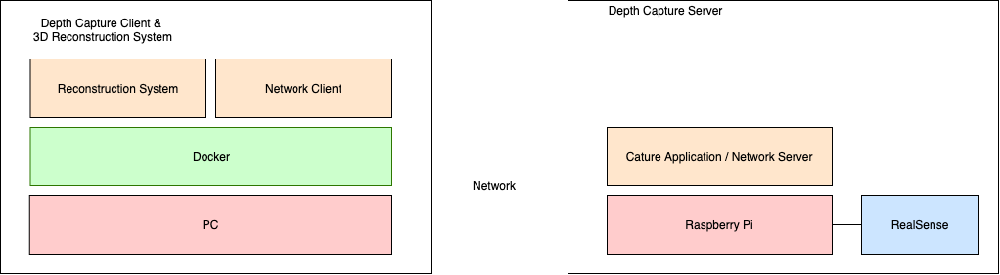

# PiSense

## What is this?
The PiSense is a capturing and reconstructing system with Raspberry Pi and RealSense.
RealSense connected to Raspberry Pi is a server-side and a powerful computer is client-side.
You can capture the depth and RGB images with the server-side and send them to the computer at the same time using a network.
You can see the capturing scene in a window opening on the computer.

Finished capturing, you can run a reconstruction pipeline, and you will get 3D data(ply format) using the captured images.

I prepared a useful Makefile to command these operations.

This repository is based on [EtherSense](https://github.com/yutashx/EtherSense), [librealsense](https://github.com/yutashx/PiSense.git), and [Open3d/examples/python](https://github.com/intel-isl/Open3D/tree/master/examples/python).

## How to use

We call the computer connected to RealSense as server-side and the other side as the client side.
On the client-side is desirable to use a computer that has a rich computational resource.
Whichever you execute a step of server, client, or reconstruction, you should clone this repository first.


### Pre-requirements
You should have installed below before
- git
- make
- docker
- Python3

### Server
#### clone this repository
```
$ git clone https://github.com/yutashx/PiSense.git
```
#### install packages
```
$ cd PiSense
$ make install_server
```

#### install `librealsense` and pyrealsense2
If you run on x86 architecture, their binary is provided.
```
$ sudo apt install librealsense
$ pip install pyrealsense2
```

If you run on other architectures such as Raspberry Pi or Jetson Nano, you should build them by yourself referencing [this page](https://github.com/IntelRealSense/librealsense/tree/master/doc) on the correct install environment.
I recommend you to execute steps `Check versions`, `Add swap`, `Install packages`, `update udev rule`, `update cmake version`, `install RealSense SDK/librealsense`,  `install pyrealsense2`, and `change pi settings`.

#### run server
```
$ make run_server
```

#### Remarks
The server side does not support docker because by binding `/dev` directory, an error is occurred resource busy.

### Client

#### clone this repository
```
$ git clone https://github.com/yutashx/PiSense.git
```

#### build docker image
```
$ cd PiSense
$ make build_client
```

#### pre requirement for running client
You should prepare for a dataset directory not included the GitHub repository.
```
$ make mkdir_dataset
```

#### run client
```
$ make run_client
```

### Reconstruction

#### clone this repository
```
$ git clone https://github.com/yutashx/PiSense.git
```

#### build docker image
```
$ cd PiSense
$ make build_reconstruction
```

#### pre requirement for running reconstruction
You should prepare for a dataset directory that not included in the GitHub repository.
If you run reconstruction on a computer that is the same as the client, it is useful to share the dataset directory.
```
$ cd ./reconstruction/reconstruction_system/
$ ln -s ../../realsense_client/dataset ./
```
If you run reconstruction on a different computer, you should make a dataset directory and put color and depth images on the directories.
```
$ mkdir -p ./reconstruction/reconstruction_system/dataset/color
$ mkdir -p ./reconstruction/reconstruction_system/dataset/depth
```

#### run reconstruction
```
$ make run_reconstruction
```

## License
MIT
